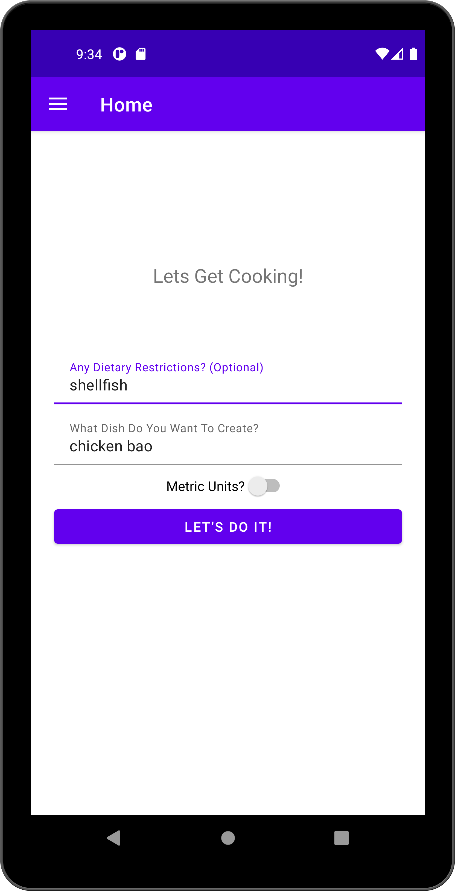
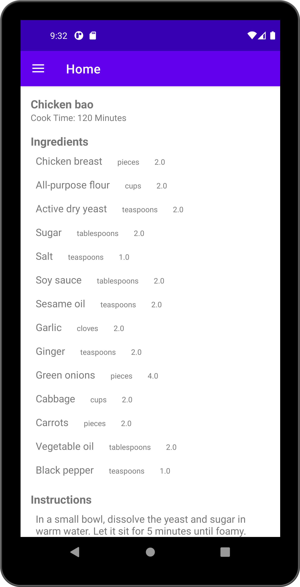

# gbtRecipies A Recipe Generator For Any Dish You Can Think Of  📖

**gbtRecipies** is a sample app that queries the OpenAI API to generate any recipe you want via the `gpt-3.5-turbo-0613` model. 

You'll have to provide your own Api Key as I'm not made of Money 💰
<br>
<br>

    


## How To Build This: 🛠
We all know that android studio can be finnicky importing projects. This project was build with Android Studio version: `Android Studio Flamingo | 2022.2.1 Patch 2` so I'd recommend matching that version of Android Studio if you're having issues importing this project. 


## I Don't Want To Read Through Your Code, What's The Magical Curl Command? 💻 
This also does the magic for ya, no app required. We can make use of the new ability of OpenAi's api to output json with a sepcific schema: 
```
curl --location 'https://api.openai.com/v1/chat/completions' \
--header 'Content-Type: application/json' \
--header 'Authorization: Bearer OPENAI_API_KEY_HERE' \
--data '{
  "model": "gpt-3.5-turbo-0613",
  "messages": [
    {"role": "system", "content": "You are a helpful assistant."},
    {"role": "user", "content": "Provide a recipe for spaghetti bolognese"}
  ],
  "functions": [
    {
      "name": "set_recipe",
      "parameters": {
	  "type": "object",
	  "properties": {
	    "ingredients": {
	      "type": "array",
	      "items": {
		"type": "object",
		"properties": {
		  "name": { "type": "string" },
		  "unit": { 
		    "type": "string",
		    "enum": ["grams", "ml", "cups", "pieces", "teaspoons"]
		  },
		  "amount": { "type": "number" }
		},
		"required": ["name", "unit", "amount"]
	      }
	    },
	    "instructions": {
	      "type": "array",
	      "description": "Steps to prepare the recipe (no numbering)",
	      "items": { "type": "string" }
	    },
	    "time_to_cook": {
	      "type": "number",
	      "description": "Total time to prepare the recipe in minutes"
	    }
	  },
	  "required": ["ingredients", "instructions", "time_to_cook"]
	}
    }
  ],
  "temperature":0
}'
```

## Demo Video 🎥 
[](https://www.youtube.com/watch?v=aR_MctsD9zY)

## Find this project useful? 🔎

* Support it by clicking the 🌟 button on the upper right of this page. 🔥


